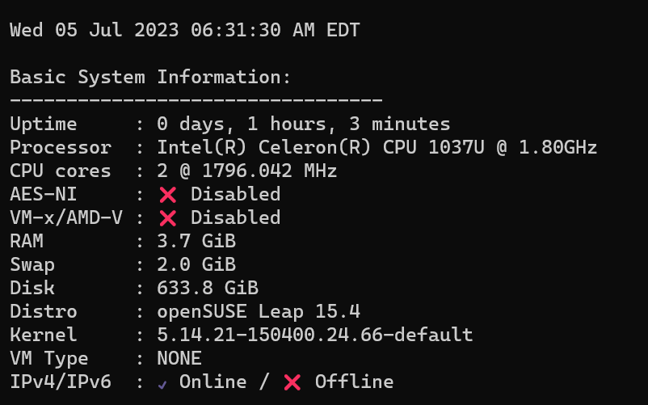
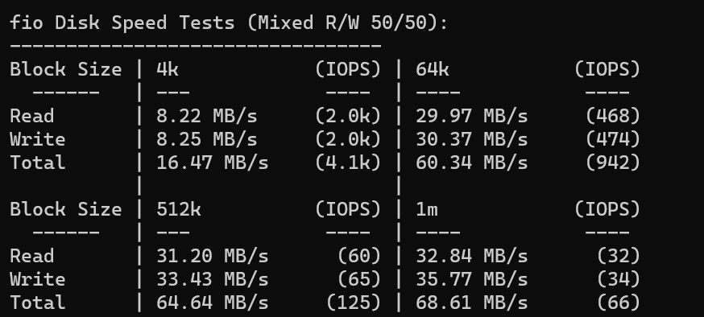
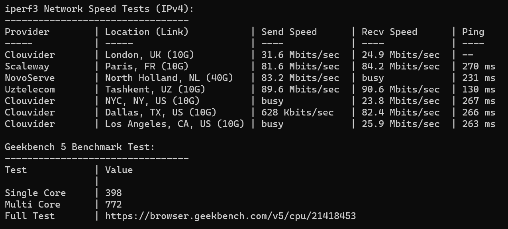

整机买回来的，4G+64G 带 Wifi 160。说实话有点亏。主要这 WIFI 我也用不上。肯定都是接有线网。

2H4G 小主机，跑了个 Opensuse，这个系统感觉不太流行。Logo 是一只蜥蜴。不知道为什么硬盘识别出来是 640G。实际上只有 64G。

硬盘，虽然是固态硬盘但是也挺慢的。

网络显然是百兆口，挂个 NAS 也够用了。CPU 正常水平。功耗方面，待机功耗 10W 左右，满载功耗 19W 左右。

拆机发现这货还能装一个 SATA，带供电，绝了。妥妥轻 NAS 配置。