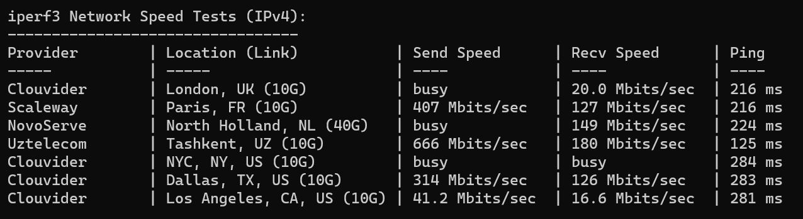

所有部件均从 PDD 购入

```
主板 精粤X99 311
CPU E5-2698B 134
内存 32G三星D3-1866*4 310
显卡 二手GT610 30
固态 海康C2000-1T 228
电源 逾辉500W 96
风扇 杂牌12*2+8*1 35
散热 杂牌 66
机箱 杂牌 36
```

共计 1246 RMB

2698B 具有 16 个核心，32 线程，最大睿频 3.4GHz，此处我已经刷好鸡血主板，运行时默认可以直接开到 3.4GHz。

DDR3 内存目前已经是白菜价，用 300 出头的价格买了 4 根 32G 三星 ECC 内存条。内存共 128G。


固态硬盘的正常读写速度。


千兆网口，感谢校园网。



跑分，单核约 900，多核约 11000。我觉得这个成绩还是很不错的。


当然功耗就不是那么美丽了。拔掉亮机卡仍然有近 100W 待机功耗。然后声音也是非常感人。。。打算跑模拟用，用的时候开一下，其他时间就关机。