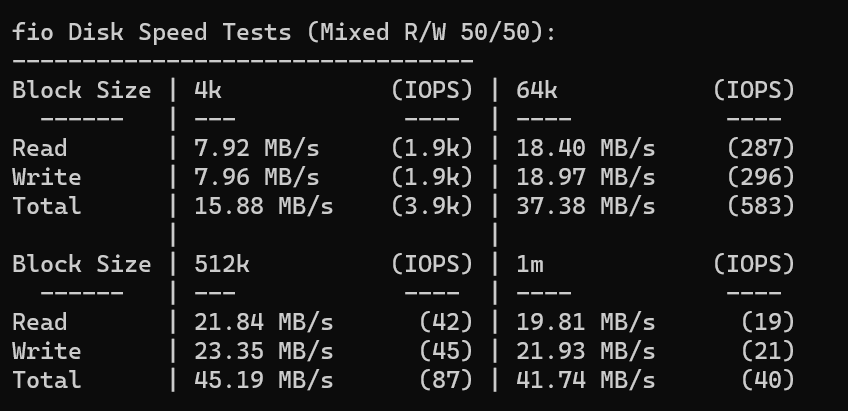

[J1800](https://www.intel.cn/content/www/cn/zh/products/sku/78866/intel-celeron-processor-j1800-1m-cache-up-to-2-58-ghz/specifications.html) 也是十年老 U 了，这次是买的整机，升腾 C92，134 带电源。嗯，就这样吧。

千兆口，挺不错的。

Geekbench 分数比较低，不过毕竟10年前的东西了，TDP 还只有 10W，跑这个分数已经非常 OK 了。

实际测算待机功耗 3~4W，跑 Geekbench 6~7W（感觉好像有点测错了？）。

唯一的缺点可能是不太好扩展，拆开看了一下没有 SATA 口之类的。当个小服务器用应该 OK。

