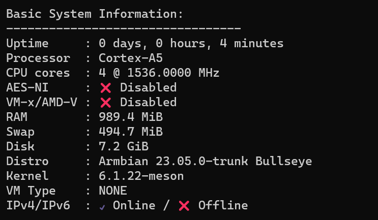
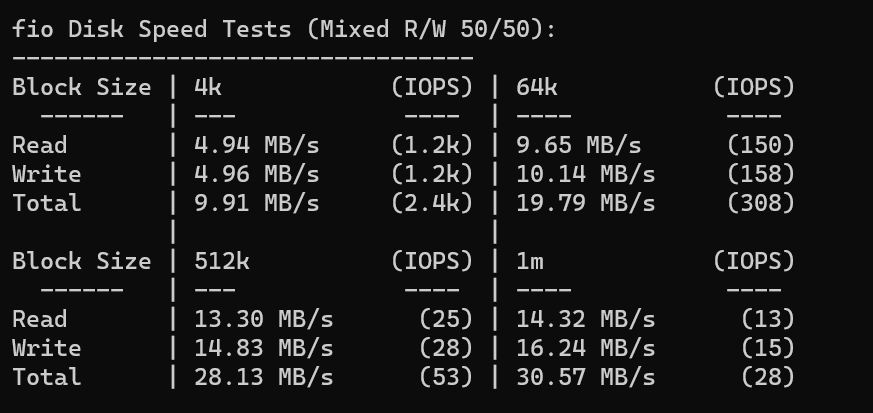
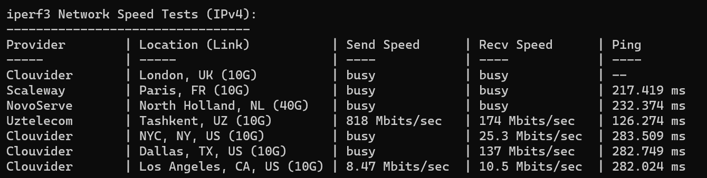
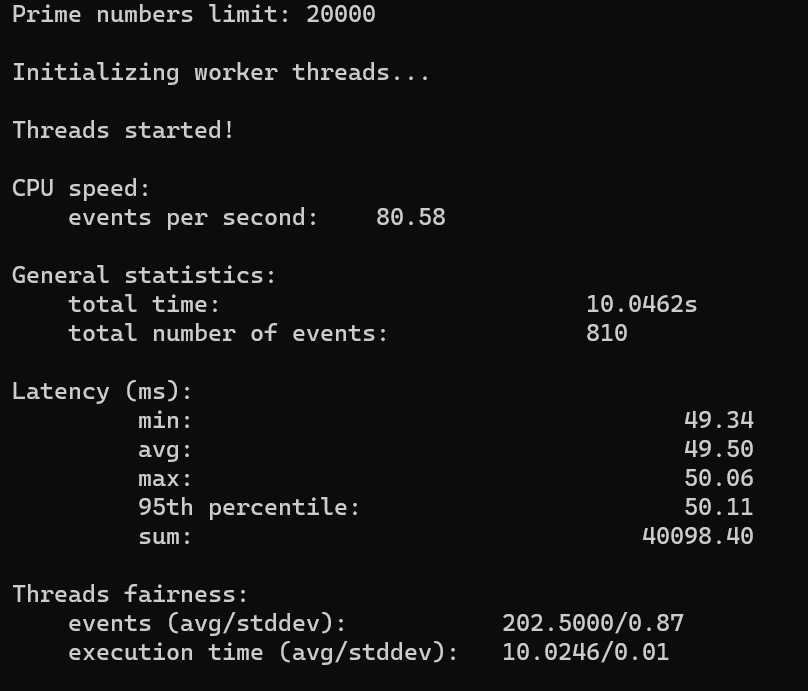

经典玩客云矿渣。全套带电源带网线 37 RMB，确实便宜，不过成色也确实是伊拉克成色。

ARMBian 系统，4 核心。



~~这货能不能开机、能不能跑动基本上看运气，平均插三次开机一次~~，搞清楚了，先拔掉网线开机，再插网线就可以了。8G eMMC 存储，IO 正常水平。



整台机子最贵的地方就是这个千兆网口。但千兆网口配一个 eMMC 内存两个 USB 2.0 的接口，我不是很懂有啥意义。



1G 内存，YABS 直接跑不起来了。换了一个[质数测试](https://www.jianshu.com/p/7a0dc79ced11)。

```
apt-get update
apt install sysbench 
sysbench --num-threads=4 --test=cpu --cpu-max-prime=20000 run
```



虽然垃圾？但是两个 USB 口挂两个硬盘盒应该跑个下载机还是可以的。毕竟这个价格。ARM 架构也是我选择的一个因素，可以练习编译一些奇特的东西。另外这个 ARM 系统基于 debian，常用的 APT 也是可以用的，很方便。

功耗贼低，待机 1.5W，跑测试 2.7 W，挂一年也耗不了多少电。