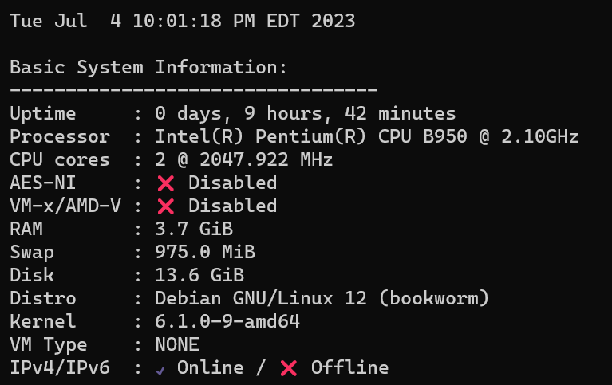
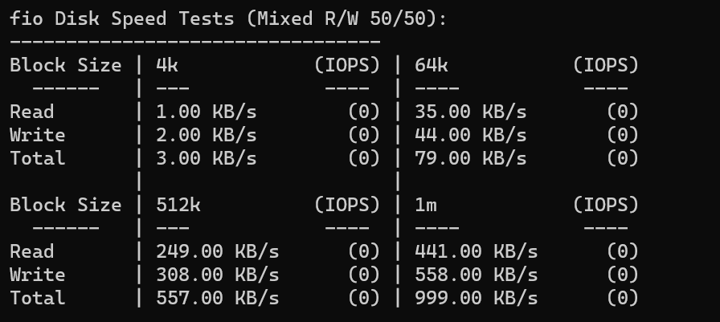
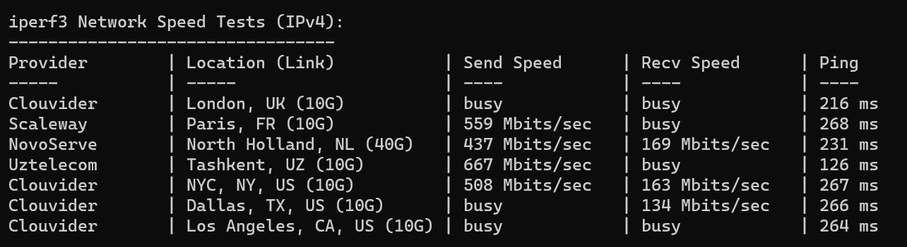
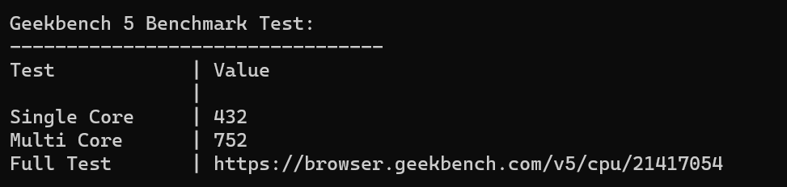

买了一块不知道从哪拆下来的板子，卖家顺便送了个 [B950](https://www.intel.cn/content/www/cn/zh/products/sku/55627/intel-pentium-processor-b950-2m-cache-2-10-ghz/specifications.html) 的U，我也懒得换，就这样吧，板子 + U 58 + 4G 内存 17 = 75，电源用的现成的。

简单介绍一下，B950，11年的U，TDP 35 W，32 nm 制程。

采用了一块2.0的U盘当系统盘，因此硬盘测试速度来到了惊人的 `1kb/s`

网口：看来是千兆口，可以

这个小板子还带了一个 SATA 口，可以接一个 2.5 的硬盘做小NAS。另外还有 mSATA 的固态口。

CPU是正常水平。但由于制程过于落后，测试时功耗直接飙到了 27W，正常待机大概 9W~11W。 

