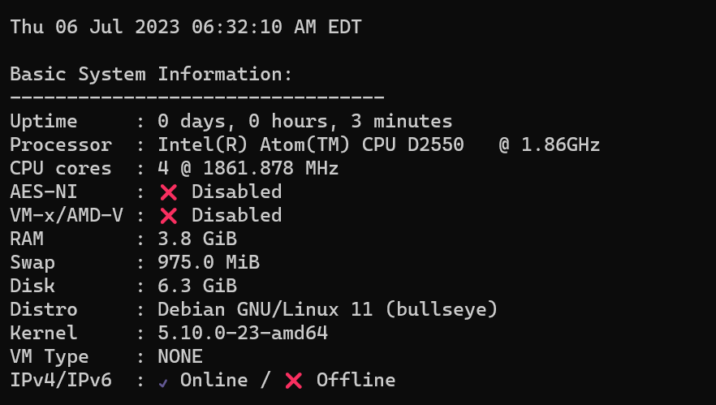
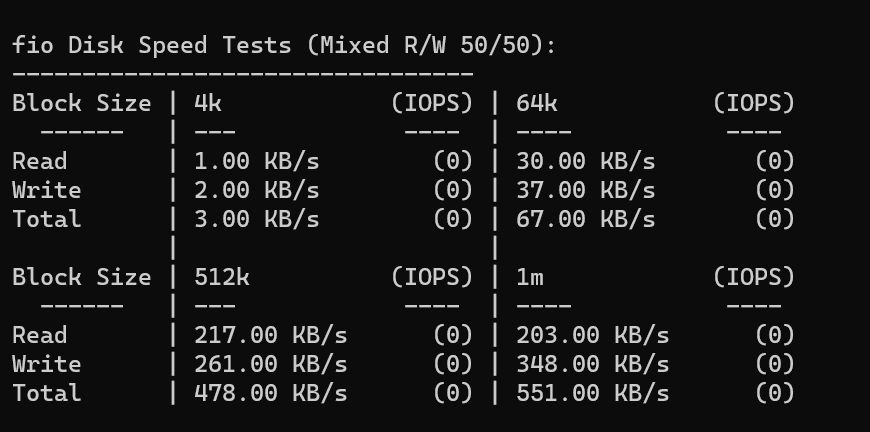
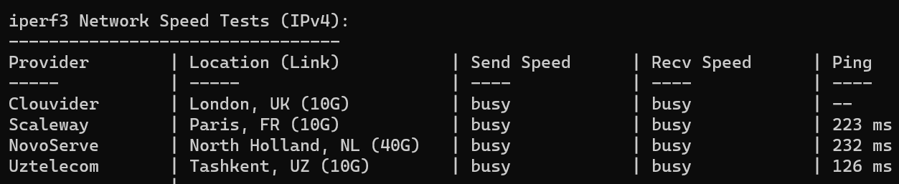
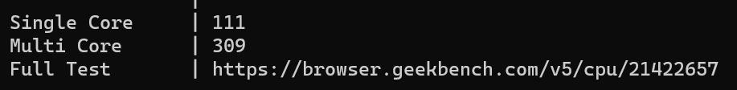
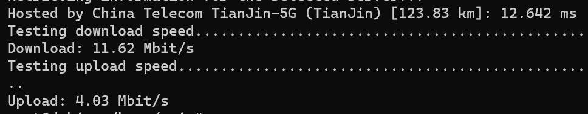

D2250 带电源主板 90 + 4G 内存条 19，有点小亏，电源可以单独买的，便宜几块钱吧。

[D2550](https://www.intel.cn/content/www/cn/zh/products/sku/65470/intel-atom-processor-d2550-1m-cache-1-86-ghz/specifications.html) 是十年前的U了，32 nm 制程，手头这个不知道历经了多少沧桑，好在一次点亮，问题不大。

还有四个核心，非常NICE。同样没有硬盘，随便搞了一个 8G USB 2.0 U 盘做系统盘，反正也没有 USB 3.0 接口。

这个 U 盘质量比昨天那个还差。绝了。果然便宜没好货。

全部超时，，我也第一次见。Geekbench 可以和 J1800 媲美了。

 
由于之前没有跑成测速，另外用 speedtest 手动跑了一遍。选了个天津节点。应该是百兆口。还可以。

功耗方面，待机 11W 左右，满载功耗 15W。

这个虽然性能比较垃圾，但是扩展性不错，带了两个 SATA 口还带供电，可以装两个硬盘做下载机。之后再看看能不能搞一个壳子。