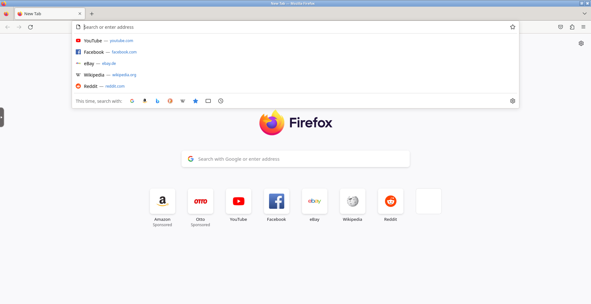

直接 docker run 搞定

```
docker run -d \
  --name=firefox \
  -p 3000:3000 \
  -p 3001:3001 \
  # 
  --shm-size="1gb" \
  -e CUSTOM_USER=user\
  -e PASSWORD=password\
  --restart unless-stopped \
  lscr.io/linuxserver/firefox:latest
```


- `shm-size`：共享内存大小，根据自己情况调整
- `CUSTOM_USER`和`PASSWORD`：用户信息，自行设定。

最后访问 3000 端口即可。



如果不慎关闭了 firefox，会退回到桌面（黑屏），如下操作。


