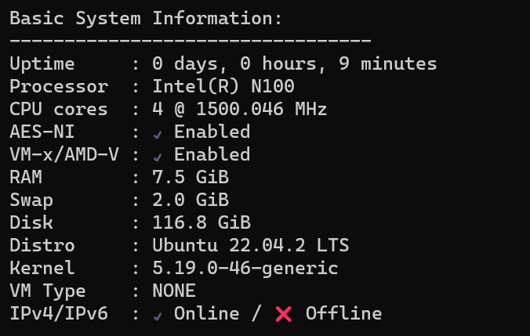
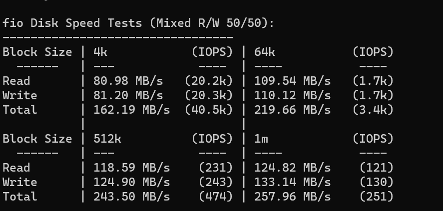
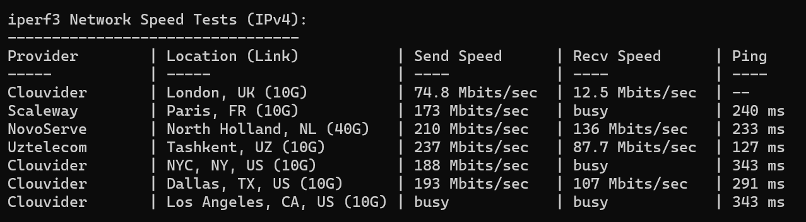
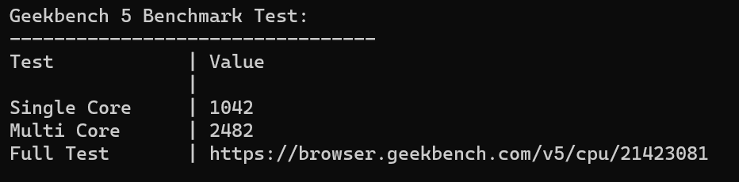

这个严格来说不算捡垃圾了。今年刚上市的 Intel [N100](https://www.intel.cn/content/www/cn/zh/products/sku/231803/intel-processor-n100-6m-cache-up-to-3-40-ghz/specifications.html)， 7nm 工艺，3.4 GHz 睿频的同时 TDP 只有 6W。购入的是第三方的一体式小主机，8G+128G 丐中丐版约 700RMB。到手拆开看了下内存和硬盘都是杂牌，不过这个价基本也就是买个 CPU 的钱。

直接用的 WIFI 测试，这个速度还可以。

GB5 单核 1000 分，对得起这个价格

功耗方面，待机功耗 3~4W ，跑 Geekbench 功耗约 19~20W。不论是日常待机用还是跑性能释放都比较好用。

拓展性，可加 SATA 固态，带 2 HDMI，带 USB3.0，唯一的缺点是不支持一线通。