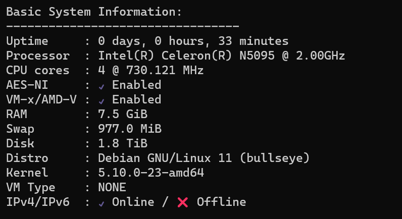
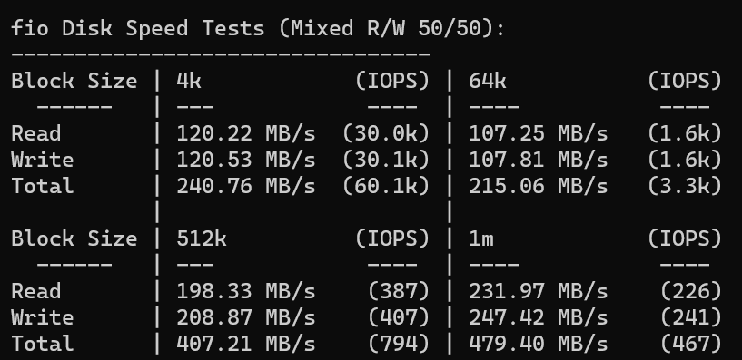
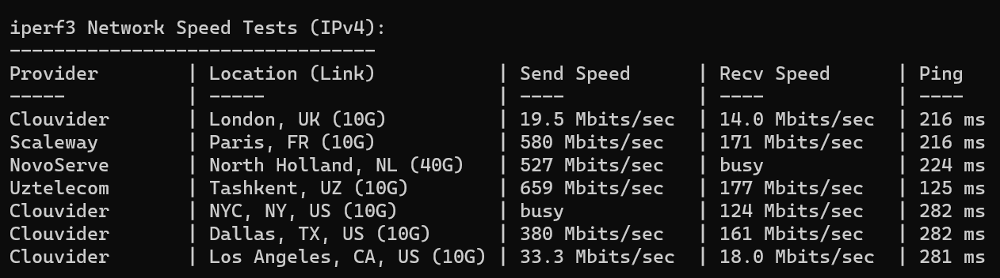
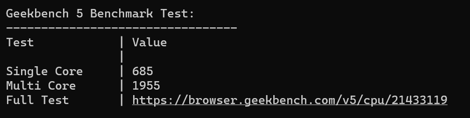

在固态硬盘疯狂跳水的今年，机械硬盘的价格竟然略有上涨。去年 350 可以拿下的海康 4T，今年花了 380 才拿下。哎，不知道之后会不会涨价。。。

```
机械 海康4T*2 760
电源 FLEX 66
主板 N5095 322
机箱 6盘位 181
固态 镁光2T二手 235
内存 杂牌D4-8G 59
其他 SATA扩展卡 96
```

共计 1719。价格大头还是这块硬盘。










不带硬盘待机 18W 负载 32W 换DC电源待机11W 加两块机械盘待机 30W

家里还有个基本一样配置的 N5105，搞个异地备份，美滋滋。