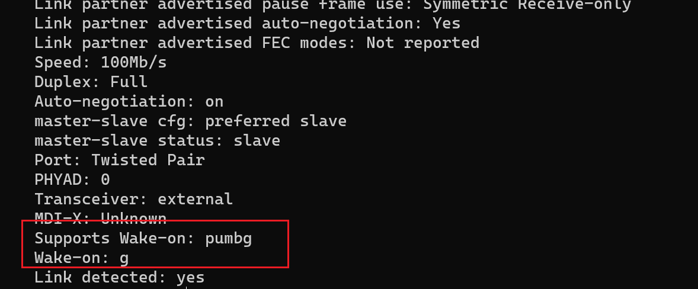

先用 `ip address` 看一下有线网卡叫什么名字，一般是 `enp5s0`。

然后用 `/sbin/ethtool enp5s0` 列出网卡状态



是否支持 WOL 以及 WOL 是否已经开启。这里我是调好了，支持并且已经开启。

使用 `/sbin/ethtool -s enp5s0 wol g` 开启 wol，不过只生效一次。。但是下次开机之后还要手动把 wol 打开。

编辑 crontab，每次启动时都自动执行以上命令，首先 `crontab -e`，然后写入

```
@reboot  /sbin/ethtool -s enp5s0 wol g
```

之后用工具唤醒即可。
