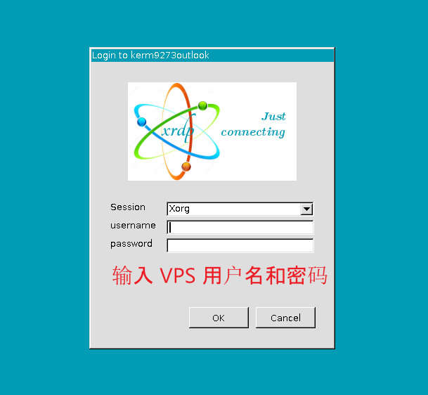
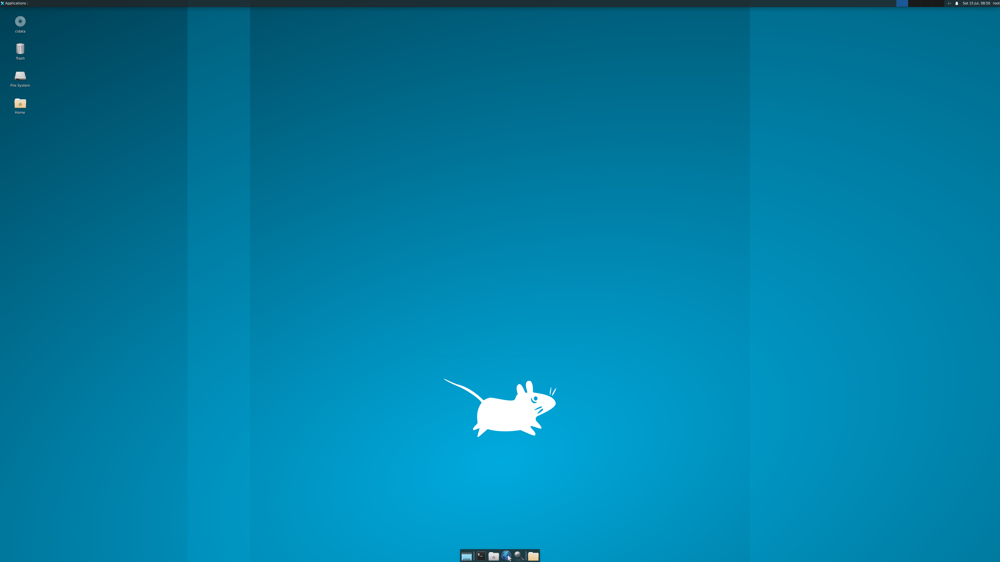

本文测试环境 Ubuntu 22.04.2 LTS。实测按照此流程可以部署，但是延迟非常感人，大概10s量级。可能是我的服务器配置比较差（2H4G）带不动。

如果是已经有桌面环境，例如 Ubuntu Desktop 这样的系统，默认应该已经安装了 `vino` 远程桌面，在 `Setting>share` 里可以找到远程桌面的选项，开启之后可以直接用 Windows 链接。这个比较适合 NAS 这样的家用服务器。直接连上去操作，使用时保持桌面处于激活状态。


在服务器系统上。也可以使用`xrdp` 部署远程桌面。

服务器默认没有桌面环境，可以装一个 Xface，比较轻量。

```
sudo apt-get update
sudo DEBIAN_FRONTEND=noninteractive apt-get -y install xfce4
sudo apt install xfce4-session
```

然后安装 xrdp 远程桌面软件。

```
sudo apt-get -y install xrdp
sudo systemctl enable xrdp
# 向 xrdp 用户授予证书访问权限
sudo adduser xrdp ssl-cert
#  配置 xrdp 以使用 xfce 作为桌面环境，如下所示
echo xfce4-session >~/.xsession
# 重新启动 xrdp 服务使更改生效，如下所示
sudo service xrdp restart
```


然后直接用 Windows 的远程桌面连接访问即可。

如果没问题的话会转到这个界面。



输入用户名密码登录，**然后就是一段漫长的黑屏过程。**耐心等待。

可以看到该有的还是有了，就是这个速度实在是难以恭维。

